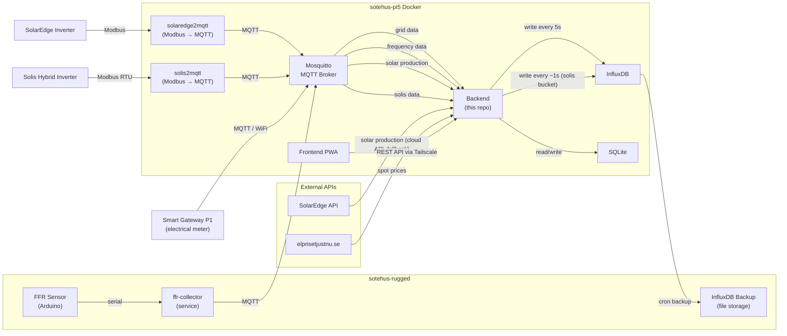

# Sotehus Backend

A Go application that provides real-time energy monitoring data via a REST API.

## Table of Contents

- [System Overview](#system-overview)
  - [Infrastructure](#infrastructure)
  - [Data Sources](#data-sources)
  - [Storage](#storage)
  - [Frontend](#frontend)
  - [System Diagram](#system-diagram)
- [Overview](#overview)
- [Swagger UI](#swagger-ui)
- [API Endpoints](#api-endpoints)
  - [GET /api/data](#get-apidata)
  - [GET /api/timeseries](#get-apitimeseries)
  - [GET /api/version](#get-apiversion)
  - [GET /api/energy/consumed](#get-apienergyconsumed)
  - [GET /api/energy/sold](#get-apienergysold)
  - [GET /api/energy/cost](#get-apienergycost)
  - [GET /api/solis](#get-apisolis)
  - [GET /api/solis/soc](#get-apisolissoc)
  - [GET /health](#get-health)
- [Persistent Parameters](#persistent-parameters)
  - [Overview](#parameters-overview)
  - [Default Parameters](#default-parameters)
  - [GET /api/params](#get-apiparams)
  - [GET /api/params/{key}](#get-apiparamskey)
  - [POST /api/params](#post-apiparams)
  - [PUT /api/params/{key}](#put-apiparamskey)
- [Architecture](#architecture)
  - [Grid Process](#grid-process)
  - [Price Process](#price-process)
  - [Solar Process](#solar-process)
  - [FFR Process](#ffr-process)
  - [Solis Process](#solis-process)
- [Configuration](#configuration)
- [Project Structure](#project-structure)
- [Building and Running](#building-and-running)
- [Testing](#testing)
- [Changelog](#changelog)

## System Overview

The Sotehus system monitors and visualizes energy data for a household with solar panels. It collects data from local sensors and external APIs, persists it in a time-series database, and serves it to a frontend application.

### Infrastructure

| Host | Role |
|------|------|
| **sotehus-pi5** | Main server running Backend, Frontend (PWA), InfluxDB, and Mosquitto broker as Docker containers |
| **sotehus-rugged** | Runs the FFR collector service. Also serves as backup target for InfluxDB (via cron job) |

### Data Sources

**Local (via MQTT → Mosquitto broker on sotehus-pi5):**

- **Smart Gateway P1** – A dongle connected to the P1 port of the electrical meter. Emits detailed import/export power, voltage, and current data every 5 seconds over local WiFi. ([smartgateways.se](https://smartgateways.se/))
- **FFR Sensor** – An Arduino system measuring grid frequency at high precision. Data is sent via serial link to the [ffr-collector](https://github.com/jorgen-simonsson/ffr-collector) service on sotehus-rugged, which converts it to MQTT and publishes to the Mosquitto broker at high rate.
- **SolarEdge Inverter (Modbus → MQTT)** – A local container running [solaredge2mqtt](https://github.com/DerOetzi/solaredge2mqtt) reads solar production data directly from the SolarEdge inverter via Modbus and publishes it to the MQTT topic `solaredge/modbus/inverter`. This replaces the cloud API when the `use_local_mqtt_solar` parameter is enabled.
- **Solis Inverter (Modbus → MQTT)** – A local `solis2mqtt` daemon reads grid meter and battery/inverter telemetry from a Solis hybrid inverter via Modbus RTU and publishes a flat JSON payload to the MQTT topic `solis/modbus` every ~1 second. See `SOLIS_MQTT_PAYLOAD.md` for the full payload schema.

**External APIs:**

- **SolarEdge** (`https://monitoringapi.solaredge.com`) – Current solar production data
- **Spot prices** (`https://www.elprisetjustnu.se/api/v1/prices`) – Current electricity spot prices

### Storage

- **InfluxDB** – Time-series database for all sensor data, persisted every 5 seconds. Runs as a Docker container on sotehus-pi5. Backups are scheduled via cron to file storage on sotehus-rugged.
- **SQLite** – Persistent parameter store for configurable price additions, VAT, etc.

#### InfluxDB Fields

All data is written to the `power_monitoring` measurement. The grid service aggregates values from multiple sources into a single InfluxDB point every write cycle (~5 seconds).

| Field | Source | Description |
|-------|--------|-------------|
| `grid_power` | MQTT `dsmr/reading/powerdelivered_netto` | Current grid power consumption (kW) |
| `grid_enery_consumed_ack` | MQTT `dsmr/reading/electricity_delivered_1` | Lifetime energy consumed accumulator (kWh) |
| `grid_enery_sold_ack` | MQTT `dsmr/reading/electricity_returned_1` | Lifetime energy sold accumulator (kWh) |
| `grid_frequency` | MQTT `ffr_collector` | Average grid frequency since last write (Hz) |
| `spot_price` | elprisetjustnu.se API | Current electricity spot price (SEK/kWh) |
| `solar_production` | MQTT `solaredge/modbus/inverter` / SolarEdge API | Current solar production (kW) |
| `solar_energy_ack` | MQTT `solaredge/modbus/inverter` → `energytotal` | Lifetime solar energy accumulator (Wh) |
| `solar_frequency` | MQTT `solaredge/modbus/inverter` → `ac.frequency` | AC frequency reported by the inverter (Hz) |

Solis inverter data is written separately, to its own `solis` bucket (created automatically on startup if it doesn't exist) rather than into `power_monitoring`. Each MQTT payload received on `solis/modbus` becomes one record in the `solis_inverter` measurement, with every property from the payload (`voltage.L1`, `current.L1`, `power.total`, `battery.SOC`, `battery.power`, `solar.power`, etc. — see `SOLIS_MQTT_PAYLOAD.md`) written verbatim as a field, unmodified.

### Frontend

The frontend is a PWA ([sotehus-pwa](https://github.com/jorgen-simonsson/sotehus-pwa)) running as a Docker container on sotehus-pi5. It accesses the backend via Tailscale to view data and edit parameters.

### System Diagram



## Overview

This backend service aggregates data from multiple sources to provide:
- **Grid Consumption** - Real-time power consumption from smart meter via MQTT
- **Electricity Price** - Current spot price per kWh from Swedish electricity market
- **Solar Production** - Current solar panel output via local MQTT (Modbus bridge) or SolarEdge cloud API
- **Grid Frequency** - Real-time grid frequency from FFR collector via MQTT

## Swagger UI

Interactive API documentation is available at:
```
http://localhost:8080/swagger/index.html
```

## API Endpoints

### `GET /api/data`

Returns current status of all energy sources.

**Response:**
```json
{
    "grid": {
        "valid": true,
        "power": 245.5,
        "lastUpdate": "2025-12-07T16:30:00+01:00",
        "message": ""
    },
    "price": {
        "valid": true,
        "price": 1.20,
        "lastUpdate": "2025-12-07T16:15:00+01:00"
    },
    "solar": {
        "valid": false,
        "power": 0,
        "lastUpdate": "2025-12-07T15:00:00+01:00",
        "message": "No sun"
    },
    "frequency": {
        "valid": true,
        "frequency": 50.01,
        "lastUpdate": "2025-12-07T16:30:00+01:00"
    }
}
```

**Field descriptions:**
- `valid` - Whether the data is current and reliable
- `power` - Power in Watts
- `price` - Price in SEK per kWh
- `frequency` - Grid frequency in Hz (e.g., 50.01)
- `lastUpdate` - Timestamp of last successful data update
- `message` - Error or status message (e.g., "No sun", "No current data for grid consumption")

### `GET /api/timeseries`

Returns statistics about the historical data stored in InfluxDB.

**Response:**
```json
{
    "first": "2025-11-01T16:10",
    "last": "2025-12-07T16:30",
    "count": 523847
}
```

**Field descriptions:**
- `first` - Timestamp of the oldest entry in the database (local time)
- `last` - Timestamp of the newest entry in the database (local time)
- `count` - Total number of grid power entries

### `GET /api/version`

Returns the API version.

**Response:**
```json
{
    "version": "1.7.0"
}
```

### `GET /api/energy/consumed`

Returns the energy consumed in kWh between two timestamps.

**Parameters:**
- `start` - Start timestamp in RFC3339 format (e.g., `2026-02-01T00:00:00+01:00`)
- `stop` - Stop timestamp in RFC3339 format (e.g., `2026-02-21T00:00:00+01:00`)

**Response:**
```json
{
    "start": "2026-02-01T00:00:00+01:00",
    "stop": "2026-02-21T00:00:00+01:00",
    "actual_start": "2026-02-01T00:01:23+01:00",
    "actual_stop": "2026-02-20T23:59:45+01:00",
    "consumed": 523.45,
    "unit": "kWh"
}
```

**Field descriptions:**
- `start` / `stop` - Requested time range
- `actual_start` / `actual_stop` - Actual timestamps where data was found
- `consumed` - Energy consumed in kWh (difference between accumulator values)

**Errors:**
- Returns 500 if no data exists at or before the start or stop timestamp

### `GET /api/energy/sold`

Returns the energy sold (exported to grid) in kWh between two timestamps.

**Parameters:**
- `start` - Start timestamp in RFC3339 format (e.g., `2026-02-01T00:00:00+01:00`)
- `stop` - Stop timestamp in RFC3339 format (e.g., `2026-02-21T00:00:00+01:00`)

**Response:**
```json
{
    "start": "2026-02-01T00:00:00+01:00",
    "stop": "2026-02-21T00:00:00+01:00",
    "actual_start": "2026-02-01T00:01:23+01:00",
    "actual_stop": "2026-02-20T23:59:45+01:00",
    "sold": 123.45,
    "unit": "kWh"
}
```

**Field descriptions:**
- `start` / `stop` - Requested time range
- `actual_start` / `actual_stop` - Actual timestamps where data was found
- `sold` - Energy sold in kWh (difference between accumulator values)

**Errors:**
- Returns 500 if no data exists at or before the start or stop timestamp

### `GET /api/energy/cost`

Returns the actual energy cost for a period, broken down by spot-price blocks.

The endpoint queries InfluxDB for `spot_price`, consumed-energy and sold-energy accumulator readings in the requested time range. Data is downsampled to hourly resolution using `aggregateWindow(every: 1h, fn: last)` before processing, reducing ~500k raw records to ~720 per month for fast response times (<1 second for a full calendar month).

Records are grouped into blocks of consecutive constant spot price. Block boundaries overlap: each new block measures energy starting from the previous block's last accumulator value, so no energy is lost between blocks. Configured price additions (transfer fee, energy tax, dynamic and static additions) are added on top of the spot price for each block. VAT is applied to the consumption cost total. A production benefit is then subtracted from the VAT-inclusive total — VAT is **not** applied to the production benefit.

The production benefit per block is calculated as `(spot_price + grid_benefit + eon_added) × produced_kwh`. The sum of all block decreases is subtracted from the final cost: `total_cost = cost_before_vat × (1 + vat/100) − production_benefit`.

If no spot price is recorded for a given time window, the most recent previous value is carried forward (InfluxDB `fill(usePrevious: true)`).

**Parameters:**
- `start` – Start timestamp in RFC3339 format (e.g., `2026-02-01T00:00:00+01:00`)
- `stop` – Stop timestamp in RFC3339 format (e.g., `2026-02-21T00:00:00+01:00`)

**Response:**
```json
{
    "period_start": "2026-02-01T00:00:00+01:00",
    "period_stop": "2026-02-21T00:00:00+01:00",
    "total_consumed_kwh": 156.78,
    "total_produced_kwh": 23.45,
    "cost_before_vat": 180.73,
    "vat_percent": 25,
    "production_benefit": 5.67,
    "total_cost": 220.24,
    "unit": "SEK",
    "blocks": [
        {
            "spot_price": 0.45,
            "added_prices": 0.7026,
            "total_price": 1.1526,
            "consumed_kwh": 12.34,
            "produced_kwh": 1.50,
            "cost": 14.22,
            "start": "2026-02-01T00:00:00+01:00",
            "stop": "2026-02-01T01:00:00+01:00"
        }
    ]
}
```

**Field descriptions:**
- `period_start` / `period_stop` – Requested time range
- `total_consumed_kwh` – Total energy consumed in the period (kWh)
- `total_produced_kwh` – Total energy sold back to the grid in the period (kWh)
- `cost_before_vat` – Sum of all block costs before VAT (SEK)
- `vat_percent` – VAT percentage applied (from persistent parameters)
- `production_benefit` – Total cost reduction from solar production (SEK, no VAT applied)
- `total_cost` – Final cost: `cost_before_vat × (1 + vat/100) − production_benefit` (SEK)
- `blocks` – Array of per-price-block breakdowns:
  - `spot_price` – Spot price during this block (SEK/kWh)
  - `added_prices` – Sum of transfer, energy tax, dynamic and static additions (SEK/kWh)
  - `total_price` – `spot_price + added_prices` (SEK/kWh)
  - `consumed_kwh` – Energy consumed in this block (kWh)
  - `produced_kwh` – Energy sold back to the grid in this block (kWh)
  - `cost` – Net cost for the block: `consumed_kwh × total_price − produced_kwh × (spot_price + grid_benefit + eon_added)` (SEK). Can be negative when production earnings exceed consumption cost.
  - `start` / `stop` – Time boundaries of this block

**Errors:**
- `400` – Missing or invalid start/stop parameter, or stop is before start
- `500` – Failed to fetch parameters or query InfluxDB
- `503` – InfluxDB or parameter store not configured

### `GET /api/solis`

Returns the most recent record from the `solis` InfluxDB bucket, with household load derived from the grid/battery/solar power balance.

**Response:**
```json
{
    "timestamp": "2025-12-07T16:30:00+01:00",
    "grid_power": 0.23,
    "solar_power": 5450.23,
    "battery_power": 1234.10,
    "household_load": 923.56,
    "battery_soc": 34
}
```

**Field descriptions:**
- `timestamp` – Time of the most recent Solis record (local time)
- `grid_power` – From `power.total`. Positive = exporting to the grid, negative = importing
- `solar_power` – From `solar.power` (inverter AC output)
- `battery_power` – From `battery.power`. Positive = charging, negative = discharging
- `household_load` – Calculated, not read directly: `solar_power − battery_power − grid_power`. This is the power balance identity — what flows in (solar production + battery discharge + grid import) must equal what flows out (household load + battery charge + grid export)
- `battery_soc` – From `battery.SOC` (%)

**Errors:**
- `404` – No data found in the `solis` bucket yet
- `500` – Failed to query InfluxDB
- `503` – InfluxDB not configured

### `GET /api/solis/soc`

Returns battery state of charge as a time series, averaged into fixed-size windows across the requested range.

The endpoint queries the `battery.SOC` field in the `solis` bucket and downsamples it with Flux `aggregateWindow(every: <am>m, fn: mean)`. One data point is returned per window that contains data — e.g. a 24-hour range with `am=15` returns 96 data points.

**Parameters:**
- `start` – Start timestamp in RFC3339 format (e.g., `2026-02-01T00:00:00+01:00`)
- `stop` – Stop timestamp in RFC3339 format (e.g., `2026-02-21T00:00:00+01:00`)
- `am` – Aggregation window in minutes (e.g., `15`)

**Response:**
```json
[
    {
        "timestamp": "2026-02-01T00:15:00+01:00",
        "value": 78.5
    },
    {
        "timestamp": "2026-02-01T00:30:00+01:00",
        "value": 79.1
    }
]
```

**Field descriptions:**
- `timestamp` – Window timestamp (local time)
- `value` – Mean `battery.SOC` (%) over that window

**Errors:**
- `400` – Missing or invalid start/stop/am parameter, or stop is before start
- `500` – Failed to query InfluxDB
- `503` – InfluxDB not configured

### `GET /health`

Health check endpoint.

**Response:**
```json
{
    "status": "ok"
}
```

## Persistent Parameters

### Parameters Overview

The application includes a persistent parameter store backed by SQLite. Parameters are key-value configuration entries stored in a local database file, allowing runtime configuration that survives restarts.

Each parameter has the following fields:

| Field | Type | Description |
|-------|------|-------------|
| `id` | UUID string | Auto-generated unique identifier |
| `key` | string | Unique key identifying the parameter |
| `description` | string | Human-readable description |
| `content` | JSON string | Parameter value as a JSON string |
| `changed` | timestamp | Last modification time |

The SQLite database is stored at the path configured by `SQLITE_DB_PATH` (default: `./data/params.db`). When running with Docker, a volume mount ensures the database persists across container restarts.

### Default Parameters

The following parameters are automatically seeded on first startup if they don't already exist:

| Key | Description | Default Content |
|-----|-------------|----------------|
| `TransferAddPrice` | Electricity transfer addition to price | `{"value": 0.2584}` |
| `EnergyTaxAddPrice` | Energy tax addition to price | `{"value": 0.36}` |
| `DynamicAddPrice` | Dynamic addition to price | `{"value": 0.0442}` |
| `StaticAddPrice` | Static addition to price | `{"value": 0.04}` |
| `VAT` | VAT percent | `{"value": 25}` |
| `grid_benefit` | Grid production benefit | `{"value": 0.0844}` |
| `eon_added` | EON production addition | `{"value": 0.02}` |
| `location_name` | Location name | `{"value": "Sotehus"}` |
| `use_local_mqtt_solar` | Use local MQTT data for solar production | `{"value": true}` |

Default parameters are defined in `internal/storage/params/model.go` and can be extended by adding entries to the `DefaultParams` slice.

### `GET /api/params`

Returns all persistent parameters.

**Response:**
```json
[
    {
        "id": "550e8400-e29b-41d4-a716-446655440000",
        "key": "DynamicAddPrice",
        "description": "Dynamic addition to price",
        "content": "{\"value\": 0.04}",
        "changed": "2026-01-15T10:30:00+01:00"
    },
    {
        "id": "6ba7b810-9dad-11d1-80b4-00c04fd430c8",
        "key": "StaticAddPrice",
        "description": "Static addition to price",
        "content": "{\"value\": 0.06}",
        "changed": "2026-01-15T10:30:00+01:00"
    }
]
```

### `GET /api/params/{key}`

Returns a single parameter by its key.

**Path parameters:**
- `key` - The parameter key (e.g., `DynamicAddPrice`)

**Response (200):**
```json
{
    "id": "550e8400-e29b-41d4-a716-446655440000",
    "key": "DynamicAddPrice",
    "description": "Dynamic addition to price",
    "content": "{\"value\": 0.04}",
    "changed": "2026-01-15T10:30:00+01:00"
}
```

**Errors:**
- `404` - Parameter not found

### `POST /api/params`

Creates a new parameter. Returns `409 Conflict` if a parameter with the same key already exists.

**Request body:**
```json
{
    "key": "MyNewParam",
    "description": "A custom parameter",
    "content": "{\"enabled\": true, \"threshold\": 0.5}"
}
```

**Response (201):**
```json
{
    "id": "a1b2c3d4-e5f6-7890-abcd-ef1234567890",
    "key": "MyNewParam",
    "description": "A custom parameter",
    "content": "{\"enabled\": true, \"threshold\": 0.5}",
    "changed": "2026-02-22T14:00:00+01:00"
}
```

**Errors:**
- `400` - Invalid request body or missing key
- `409` - Parameter with this key already exists

### `PUT /api/params/{key}`

Updates an existing parameter's description and content.

**Path parameters:**
- `key` - The parameter key to update

**Request body:**
```json
{
    "description": "Updated description",
    "content": "{\"value\": 0.10}"
}
```

**Response (200):**
```json
{
    "id": "550e8400-e29b-41d4-a716-446655440000",
    "key": "DynamicAddPrice",
    "description": "Updated description",
    "content": "{\"value\": 0.10}",
    "changed": "2026-02-22T14:05:00+01:00"
}
```

**Errors:**
- `400` - Invalid request body
- `404` - Parameter not found

## Architecture

The application runs background processes alongside the HTTP server:

### Grid Process
- Subscribes to multiple MQTT topics defined in `GridTopics` for real-time power and energy data
- Aggregates values from all topics before writing to InfluxDB
- Waits up to 2 seconds for all topic values to arrive, then writes a single record
- Logs a warning if timeout occurs before all values are received (incomplete data is still written)
- Writes each aggregated data point to InfluxDB for historical tracking
- Marks data as invalid if no MQTT message received for 1 minute

#### Adding New Grid Topics

To add more MQTT topics to the grid data collection, edit the `GridTopics` slice in `internal/services/grid/grid.go`:

```go
var GridTopics = []TopicMapping{
    {Topic: "dsmr/reading/powerdelivered_netto", FieldName: "grid_power"},
    {Topic: "dsmr/reading/electricity_delivered_1", FieldName: "grid_energy_consumed"},
    {Topic: "dsmr/reading/electricity_returned_1", FieldName: "grid_energy_sold"},
    // Add new topics here:
    // {Topic: "dsmr/reading/voltage_l1", FieldName: "grid_voltage_l1"},
}
```

Each entry maps an MQTT topic to an InfluxDB field name. All values are aggregated into a single InfluxDB record.

### Price Process
- Fetches spot prices from [elprisetjustnu.se](https://www.elprisetjustnu.se) API
- Prices are provided in 15-minute intervals
- Extracts current price based on local time
- Updates every 15 minutes

### Solar Process
- Two modes controlled by the `use_local_mqtt_solar` persistent parameter (default: `true`):
  - **Local MQTT mode** (`use_local_mqtt_solar = true`): Subscribes to the MQTT topic `solaredge/modbus/inverter` for solar production data published by a local Modbus-to-MQTT bridge. Extracts `ac.power.actual` from each message as current production in Watts. Also captures `energytotal` (lifetime energy in Wh) and `ac.frequency` (inverter-reported grid frequency in Hz) and stores them in state for inclusion in InfluxDB writes. No rate limits or nighttime restrictions — data is received whenever the inverter publishes.
  - **Cloud API mode** (`use_local_mqtt_solar = false`): Fetches production from the SolarEdge Monitoring API. Respects API rate limits (300 calls/day), calculates optimal polling interval based on daylight hours, and only polls from 1 hour before sunrise until 1 hour after sunset.
- When local MQTT mode is enabled, the cloud API process stays idle (re-checks the parameter every minute)
- Both modes update the same shared state, so the `/api/data` response is identical regardless of source

### FFR Process
- Subscribes to the `ffr_collector` MQTT topic for real-time grid frequency data
- Parses 4-character payloads (e.g., "5001" → 50.01 Hz)
- Validates frequency is within expected range (48–52 Hz)
- Handles high-frequency data (many updates per second) thread-safely
- Frequency values are accumulated between InfluxDB write cycles; the **average** frequency is written to InfluxDB each cycle (not the last value)
- The API (`/api/data`) returns the same averaged frequency that was last written to InfluxDB

### Solis Process
- Subscribes to the MQTT topic `solis/modbus`, published by a local `solis2mqtt` daemon roughly once per second (see `SOLIS_MQTT_PAYLOAD.md` for the payload schema)
- Ensures the `solis` InfluxDB bucket exists on startup, creating it automatically if missing
- Writes every received MQTT payload as one record in the `solis_inverter` measurement of the `solis` bucket — all fields from the payload are stored verbatim, with no aggregation, filtering, or interpretation
- Independent of the Grid write cycle and the shared state manager — not part of `/api/data`, and not part of the `power_monitoring` measurement used by the Grid process
- Exposed via `GET /api/solis`, which reads the latest record back out of the `solis` bucket and derives `household_load` from the power balance
- Historical SOC exposed via `GET /api/solis/soc`, which averages `battery.SOC` into caller-specified time windows

## Configuration

Environment variables (`.env` file):

```bash
# Server Configuration
SERVER_PORT=8080

# MQTT Configuration
MQTT_BROKER_HOST=your_mqtt_host
MQTT_BROKER_PORT=1883
MQTT_USERNAME=your_username
MQTT_PASSWORD=your_password
# Note: Grid topics are defined statically in internal/services/grid/grid.go

# InfluxDB Configuration
INFLUXDB2_HOST=your_influxdb_host
INFLUXDB2_PORT=8086
INFLUXDB2_USER=your_user
INFLUXDB2_PASSWORD=your_password
INFLUXDB2_ORG=sotehus
INFLUXDB2_BUCKET=sotehus_bucket
INFLUXDB2_TOKEN=your_api_token

# SolarEdge Configuration
SOLAREDGE_API_KEY=your_api_key
SOLAREDGE_SITE_ID=your_site_id

# Spot Price Configuration
SPOTPRICE_REGION=SE4

# SQLite Configuration
SQLITE_DB_PATH=./data/params.db
```

## Project Structure

```
├── cmd/
│   └── server/
│       └── main.go              # Application entry point
├── internal/
│   ├── api/
│   │   ├── handler.go           # HTTP handlers
│   │   ├── router.go            # Route definitions
│   │   └── version.go           # API version constant and endpoint
│   ├── config/
│   │   └── config.go            # Environment configuration
│   ├── models/
│   │   └── data.go              # Data structures
│   ├── services/
│   │   ├── ffr/
│   │   │   └── ffr.go           # MQTT subscriber for grid frequency (FFR)
│   │   ├── grid/
│   │   │   └── grid.go          # MQTT subscriber for grid consumption
│   │   ├── price/
│   │   │   └── price.go         # Spot price fetcher
│   │   ├── solar/
│   │   │   ├── solar.go         # SolarEdge cloud API client
│   │   │   └── mqtt.go          # MQTT subscriber for local solar data (Modbus bridge)
│   │   └── solis/
│   │       └── mqtt.go          # MQTT subscriber for Solis inverter data, writes to "solis" InfluxDB bucket
│   ├── storage/
│   │   ├── influxdb.go          # InfluxDB client
│   │   └── params/
│   │       ├── errors.go        # Sentinel errors
│   │       ├── model.go         # Parameter model and defaults
│   │       └── store.go         # SQLite parameter store
│   └── state/
│       └── manager.go           # Thread-safe state management
├── docker-compose.yml
├── Dockerfile
├── go.mod
├── go.sum
├── .env.example
├── Makefile
├── README.md
└── SOLIS_MQTT_PAYLOAD.md        # Solis MQTT payload schema reference
```

## Building and Running

```bash
# Install dependencies
make deps

# Build the application
make build

# Run the application
make run

# Or run in development mode
make dev
```

### Docker

```bash
# Build and start with Docker Compose
docker compose up --build -d

# View logs
docker compose logs -f

# Stop
docker compose down
```

> **Note:** The `docker-compose.yml` mounts `./data:/app/data` to persist the SQLite parameter database across container restarts.

## Testing

The project includes comprehensive unit tests for all packages.

```bash
# Run all tests
go test ./...

# Run tests with verbose output
go test -v ./...

# Run tests with coverage report
go test -cover ./...

# Run tests for a specific package
go test -v ./internal/config
go test -v ./internal/state
go test -v ./internal/api
go test -v ./internal/storage/params
```

### Test Coverage

| Package | Coverage | Description |
|---------|----------|-------------|
| `internal/state` | 100% | Thread-safe state management |
| `internal/config` | ~95% | Configuration loading and environment variables |
| `internal/storage/params` | ~70% | SQLite parameter store (in-memory tests) |
| `internal/api` | ~50% | HTTP handlers, routing, and CORS |
| `internal/services/solis` | ~42% | MQTT subscriber for Solis inverter data (write path requires database for full testing) |
| `internal/services/price` | ~32% | Spot price fetching and matching |
| `internal/services/solar` | ~27% | SolarEdge client and sunrise/sunset calculations |
| `internal/services/ffr` | ~19% | FFR frequency parsing and MQTT subscription |
| `internal/services/grid` | ~13% | MQTT subscription (requires broker for full testing) |
| `internal/storage` | ~2% | InfluxDB client (requires database for full testing) |
| `internal/models` | N/A | Data structures (no executable code) |

Note: Some packages have lower coverage because they require external services (MQTT broker, InfluxDB, HTTP APIs) for complete integration testing. For example, `GetSOC` (backing `GET /api/solis/soc`) has handler-level tests for parameter validation and route registration, but the underlying `storage.GetSOCSeries` Flux query — like the rest of `internal/storage` — is only verified manually against a live InfluxDB instance.

## Changelog

### 2026-07-24 Ver 2.3.0
- New endpoint: `GET /api/solis/soc` – returns battery state of charge as a time series, averaged into caller-specified windows
  - New `InfluxDBClient.GetSOCSeries` queries `battery.SOC` in the `solis` bucket and downsamples with Flux `aggregateWindow(every: <am>m, fn: mean)`
  - Takes `start`, `stop` (RFC3339) and `am` (aggregation window in minutes) query parameters — e.g. a 24-hour range with `am=15` returns 96 data points
  - Swagger docs regenerated to include `api.SOCDataPoint`

### 2026-07-16 Ver 2.2.0
- New endpoint: `GET /api/solis` – returns the most recent record from the `solis` InfluxDB bucket
  - New `InfluxDBClient.GetLastSolisRecord` queries the last point of `power.total`, `solar.power`, `battery.power` and `battery.SOC`, combining them via Flux `pivot` since they share a single write timestamp
  - `household_load` is calculated (not stored) from the power balance identity: `solar_power − battery_power − grid_power`
  - New `storage.ErrNoData` sentinel error, mapped to `404` when the bucket has no data yet
  - Swagger docs regenerated to include `api.SolisResponse`

### 2026-07-16 Ver 2.1.0
- Added a new data source and background process: **Solis inverter**
  - New MQTT subscriber (`internal/services/solis/mqtt.go`) listens on the `solis/modbus` topic published by a local `solis2mqtt` daemon
  - Payload schema documented in `SOLIS_MQTT_PAYLOAD.md` (grid meter voltage/current/power per phase, battery SOC/power, solar power, meter type)
  - Data is written to a **separate** InfluxDB bucket (`solis`, auto-created on startup if missing), measurement `solis_inverter` — independent of the `power_monitoring` measurement used by the Grid process
  - Every field in each received payload is written verbatim, with no aggregation or interpretation
  - New `InfluxDBClient.EnsureBucketExists` and `InfluxDBClient.WriteToBucket` methods support writing to buckets other than the default configured one
  - Solis data is not yet exposed via any HTTP endpoint

### 2026-04-05 Ver 2.0.0
- **Major performance improvement** for `GET /api/energy/cost`: response time reduced from ~15s to <0.2s for a calendar month
  - InfluxDB Flux query reordered: `aggregateWindow(every: 1h, fn: last)` now runs before `fill(usePrevious)`, reducing the dataset from ~500k rows to ~720 before expensive operations
  - Downsample-first pipeline: aggregate → fill → pivot → sort
- Cost block boundaries now overlap: each block measures energy from the previous block's last accumulator value, eliminating energy loss at block boundaries
- Added `tools/tailflux` — a CLI tool that tails InfluxDB and prints all field values for each incoming record in real time

### 2026-04-05 Ver 1.9.0
- Added two new InfluxDB fields from solar inverter MQTT data:
  - `solar_energy_ack` – lifetime energy accumulator from `energytotal` (Wh)
  - `solar_frequency` – AC grid frequency from `ac.frequency` (Hz)
- Extended `inverterPayload` to parse `energytotal` and `ac.frequency` from MQTT messages
- New state manager methods: `UpdateSolarEnergyAck`, `GetSolarEnergyAck`, `UpdateSolarFrequency`, `GetSolarFrequency`
- Grid service includes solar energy and frequency fields in each aggregated InfluxDB write
- Added InfluxDB fields reference table to README

### 2026-04-02 Ver 1.8.0
- Added local MQTT-based solar production data source as alternative to SolarEdge cloud API
  - New MQTT subscriber (`internal/services/solar/mqtt.go`) listens on `solaredge/modbus/inverter` topic
  - Extracts `ac.power.actual` from inverter payload as current solar production in Watts
  - No rate limits or nighttime restrictions — receives data whenever the inverter publishes
- New persistent parameter `use_local_mqtt_solar` (default: `true`) controls which solar data source is active
  - When `true`: local MQTT subscriber runs, cloud API service stays idle
  - When `false`: cloud API service runs as before
- Added `ParseContentBool` helper for extracting boolean values from parameter JSON
- Cloud solar service now re-checks the parameter every minute and resumes API polling if switched back

### 2026-03-29 Ver 1.7.0
- Per-block `cost` in `GET /api/energy/cost` is now a **net cost** that subtracts production benefit
  - Block cost formula: `consumed_kwh × total_price − produced_kwh × (spot_price + grid_benefit + eon_added)`
  - Blocks where production earnings exceed consumption cost now correctly show a negative cost
- `calculateCostBlocks` now receives `gridBenefit` and `eonAdded` parameters for per-block benefit calculation
- Updated tests with corrected expected net cost values

### 2026-03-19 Ver 1.6.0
- Added **production benefit** to `GET /api/energy/cost` endpoint
  - Calculates per-block decrease: `(spot_price + grid_benefit + eon_added) × produced_kwh`
  - Subtracts total production benefit from VAT-inclusive cost (VAT is not applied to the benefit)
  - New response fields: `total_produced_kwh`, `production_benefit`, per-block `produced_kwh`
- Added `grid_enery_sold_ack` to InfluxDB Flux query for sold-energy tracking
- New default parameters: `grid_benefit` (0.0844), `eon_added` (0.02), `location_name` ("Sotehus")
- Unit tests for production benefit calculation

### 2026-03-18 Ver 1.5.0
- Frequency values written to InfluxDB are now the **average** of all samples received since the previous write, instead of the last instantaneous value
- The API (`/api/data`) now returns the same averaged frequency that was last written to InfluxDB
- Added `GetAndResetAverageFrequency` to state manager for accumulating, averaging, and resetting frequency samples between write cycles
- Unit tests for frequency averaging logic

### 2026-02-22 Ver 1.4.0
- New endpoint: `GET /api/energy/cost` – calculates actual energy cost for a period
  - Groups records into blocks of constant spot price
  - Adds configured price components (transfer, energy tax, dynamic, static)
  - Applies VAT from persistent parameters
  - Returns per-block breakdown with kWh and cost
- Added `ParseContentValue` helper for extracting numeric values from parameter JSON
- Added `GetFieldsInRange` InfluxDB query combining spot price and consumed energy
- Extended default parameters: `TransferAddPrice`, `EnergyTaxAddPrice`, `VAT`
- Consolidated InfluxDB writes: all fields written in a single record per cycle
- Comprehensive unit tests for energy cost calculation and parameter parsing
- Updated Swagger documentation

### 2026-02-22 Ver 1.3.0
- Added persistent parameter store backed by SQLite (`internal/storage/params/`)
- New endpoints: `GET /api/params`, `GET /api/params/{key}`, `POST /api/params`, `PUT /api/params/{key}`
- Default parameters seeded on startup (`DynamicAddPrice`, `StaticAddPrice`)
- Added `SQLITE_DB_PATH` configuration option (default: `./data/params.db`)
- Docker volume mount (`./data:/app/data`) for SQLite persistence
- Integration and unit tests for parameter handling
- Updated Swagger documentation with parameter endpoints
- Reconstructed README with table of contents
